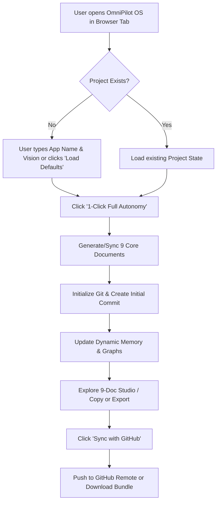

# App Flow & User Journey

## User Journey Map

## State Machine & Screen Flow

### Screen 1: Mission Control (Top Navigation & Hero Actions)
- **Top Bar**: OmniPilot Logo, Status Badge ("System Ready - 100% Autonomous"), Theme Toggle, Single-Click "Execute Full Autonomy" button, Single-Click "Sync to GitHub" button.
- **Quick Stats Bar**: Documents Generated (9/9), Git Status (Initialized/Committed), Autonomy Level (100%), SEO Score (A+).

### Screen 2: 9-Core Document Studio
- **Tabbed Interface**:
  - `01 PRD`: Product vision, problem statement, features, MVP scope.
  - `02 Architecture`: Tech stack, directory tree, database schema, 3-layer build.
  - `03 Security`: Roles matrix, auth methods, RLS rules, edge cases.
  - `04 Design`: Color tokens, typography, minimalist rules, API specs.
  - `05 Phases`: Sprints, tickets, acceptance criteria.
  - `06 Flow`: Visual flow diagrams and state machine.
  - `07 Rules`: Guardrails, what to do, what to avoid, proven libraries.
  - `08 Decision`: Decision log with alternatives and impact.
  - `09 Memory`: Live working memory with active entities.

### Screen 3: GitHub & Publishing Drawer
- Single-click local commit.
- Custom commit message input (auto-populated).
- GitHub remote repository linker (`git remote add origin ...`).
- One-click copy instructions for `gh repo create` or web upload.

### Screen 4: Search Engine & Store Discovery Panel
- Live SEO preview card (Google search snippet, OpenGraph card preview).
- PWA manifest inspector.
- Rich structured schema preview.
